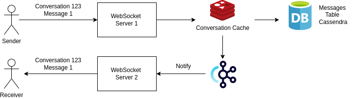

# YouChat chat messsaging service 
This serivce is the frontline service connecting with user deivces through Websocket.\
The service will receive message from user through WebSocket connection and store \
the message into conversation cache in Redis conversation cache and eventually write the message into Cassandra. 

# Architecture Diagram 
